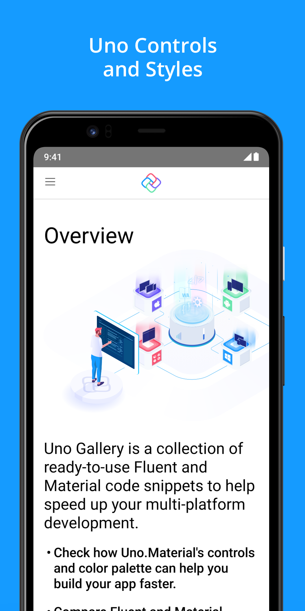
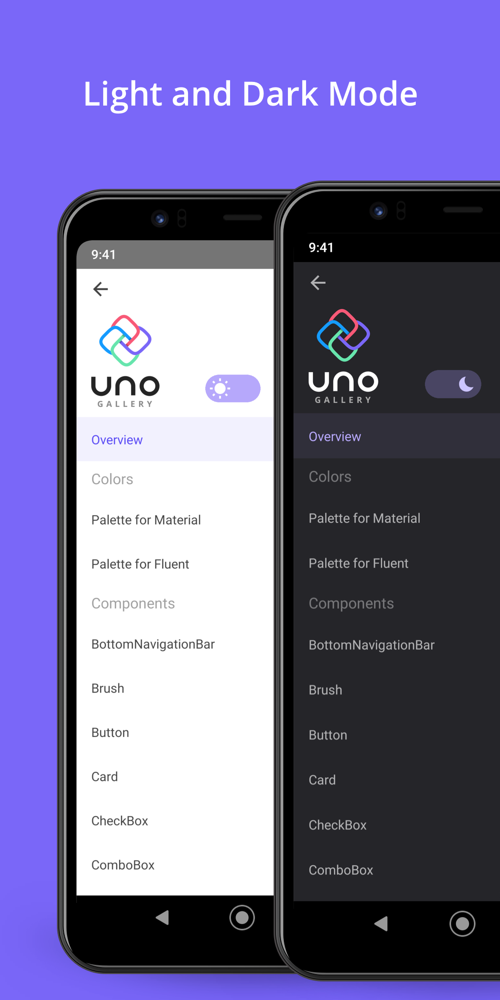
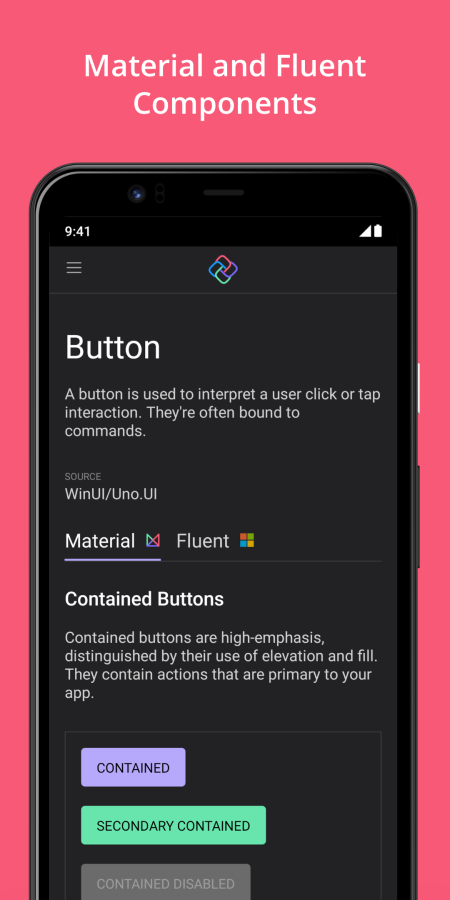
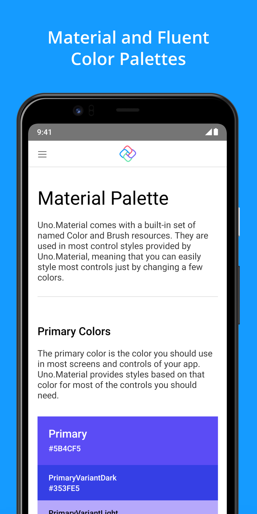

# Uno Gallery

A collection of ready-to-use Fluent and Material code snippets to help speed up your multi-platform development.

Available on:
- iOS
- Android
- Windows
- WebAssembly
- MacOS
- Linux (experimental)

## Contributing

Please read [CONTRIBUTING.md](CONTRIBUTING.md) for details on the process for
contributing to this project.

Be mindful of our [Code of Conduct](CODE_OF_CONDUCT.md).

## Acknowledgments
- [Uno Platform](https://platform.uno)
- [ShowMeTheXaml](https://github.com/Keboo/ShowMeTheXAML) for code snippets. Through [our Fork](https://github.com/unoplatform/ShowMeTheXAML)
- [WinUI](https://microsoft.github.io/microsoft-ui-xaml/)

