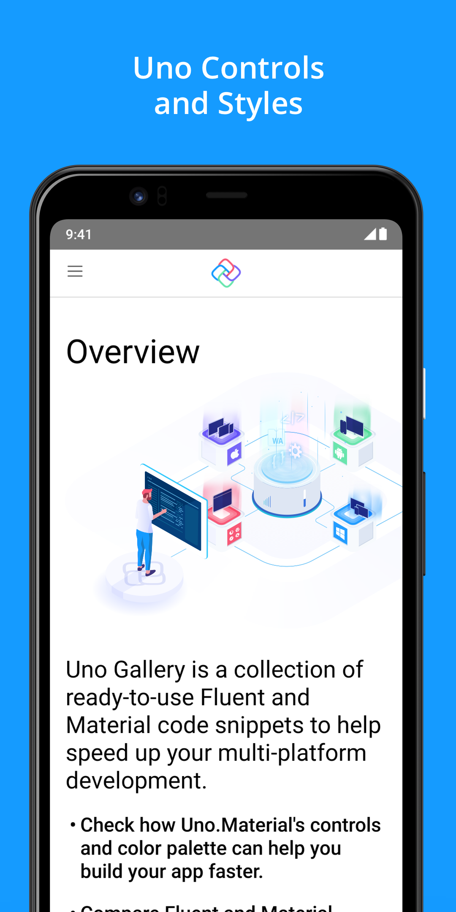
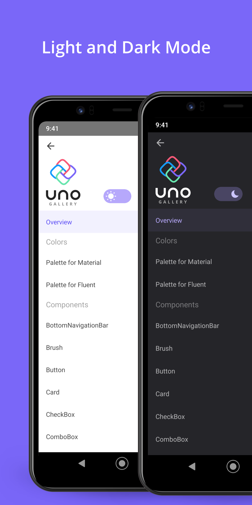
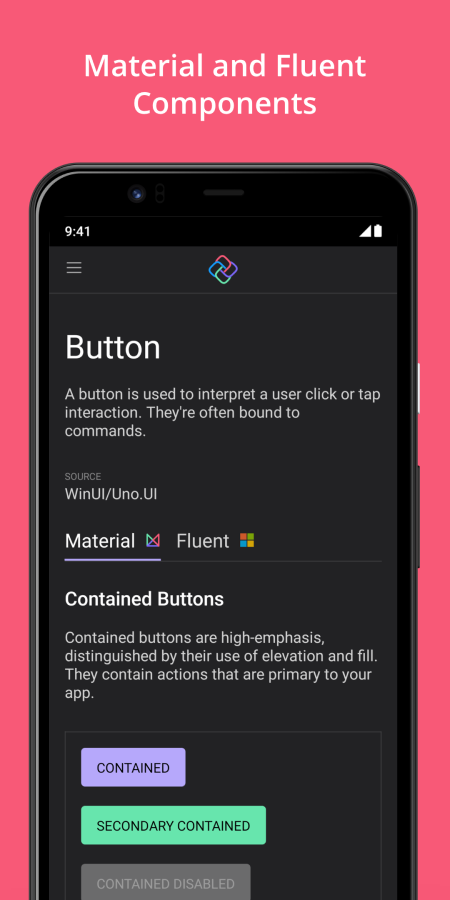
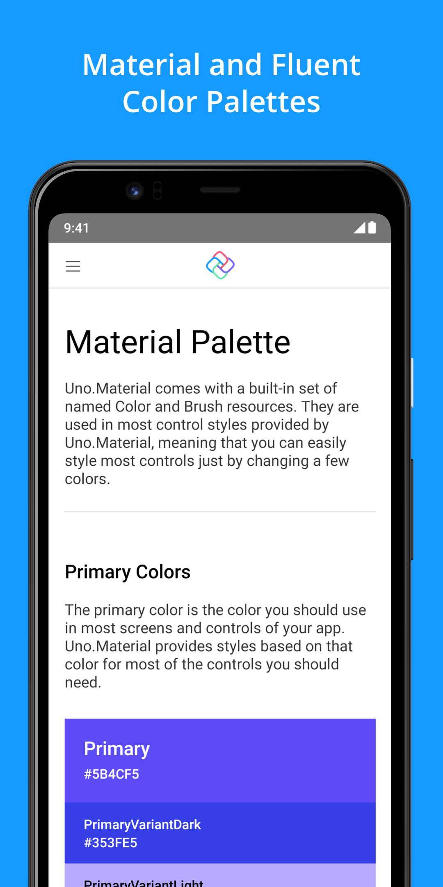

# Uno Gallery

A collection of ready-to-use Fluent and Material code snippets to help speed up your multi-platform development.

Available on:

- [The Web with WebAssembly](https://gallery.platform.uno/)
- [iOS](https://apps.apple.com/us/app/uno-gallery/id1380984680)
- [Android](https://play.google.com/store/apps/details?id=com.nventive.uno.ui.demo)
- Windows
- macOS
- Linux (experimental)

## Try out Uno Gallery

- [Uno Gallery in the browser](https://gallery.platform.uno/) (WebAssembly)
- [Uno Gallery on Google Play](https://play.google.com/store/apps/details?id=com.nventive.uno.ui.demo) (Android)
- [Uno Gallery in the App Store](https://apps.apple.com/us/app/uno-gallery/id1380984680) (iOS)

## Contributing

See [CONTRIBUTING.md](CONTRIBUTING.md) for environment setup, build commands, how to add a
sample page, and the PR / commit expectations.

> **Cupertino design system:** Cupertino samples are hidden from stable Release builds and are
> only visible in Debug, canary, and UITest configurations. See
> [docs/decisions/0001-cupertino-containment.md](docs/decisions/0001-cupertino-containment.md)
> for the rationale and limitations.

## Acknowledgments

- [Uno Platform](https://platform.uno)
- [ShowMeTheXaml](https://github.com/Keboo/ShowMeTheXAML) for code snippets. Through [our Fork](https://github.com/unoplatform/ShowMeTheXAML)
- [WinUI](https://microsoft.github.io/microsoft-ui-xaml/)

## License

